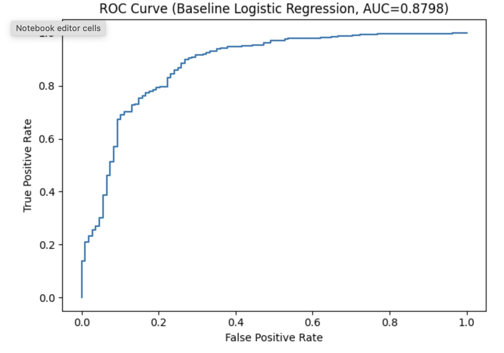
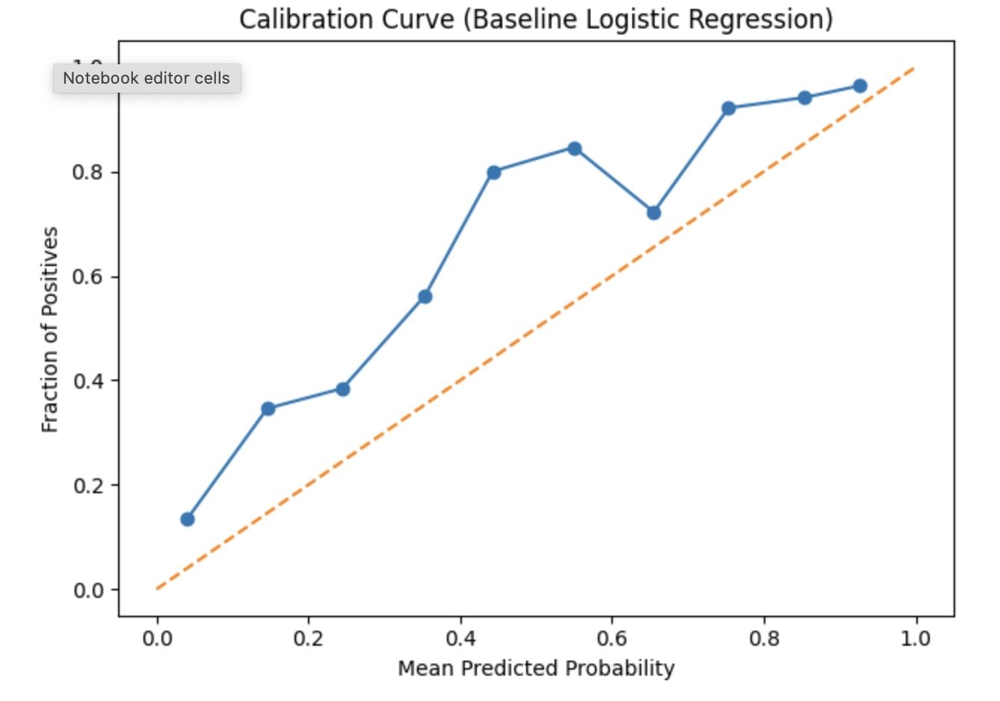

# Rainfall Occurrence Prediction (Binary Classification)

This project develops an end-to-end machine learning pipeline to predict the probability of rainfall occurrence using tabular environmental data.  
The focus is on building a clean, interpretable baseline model and evaluating probability quality rather than maximizing leaderboard performance.

---

## Project Overview

- **Task**: Binary classification — predict whether rainfall occurs
- **Output**: Probabilistic predictions (likelihood of rainfall)
- **Approach**: Baseline Logistic Regression with a full preprocessing pipeline
- **Evaluation**: ROC-AUC, calibration analysis, and threshold-based error trade-offs

This project was conducted as a self-directed machine learning workflow and emphasizes reproducibility, interpretability, and decision-oriented evaluation.

---

## Dataset

- Tabular environmental features (e.g., temperature, humidity, pressure, wind)
- Target variable: `rainfall` (binary)
- Dataset size: 2,190 observations
- No missing values in training data; missing values in test data handled via imputation in the pipeline

---

## Workflow Summary

### 1) Data Inspection
- Verified dataset schema and feature types
- Identified non-predictive identifier column (`id`)
- Checked class balance and data quality

### 2) Exploratory Data Analysis (Minimal)
- Visualized target distribution
- Inspected numeric feature distributions
- Confirmed no obvious anomalies prior to modeling

### 3) Baseline Model
Logistic Regression with a preprocessing pipeline:
- Median imputation for numeric features
- Most-frequent imputation for categorical features
- Standard scaling and one-hot encoding
- Stratified train/validation split

### 4) Model Evaluation
- Baseline performance: **ROC-AUC ≈ 0.88** (validation split)
- ROC curve used to visualize class separation

<p align="center">
  
</p>

### 5) Probability Calibration
- Examined a calibration curve to assess the reliability of predicted probabilities
- Observed mild under-confidence in mid-range probabilities

<p align="center">
  
</p>

### 6) Threshold Analysis
- Evaluated confusion matrices across multiple decision thresholds
- Analyzed trade-offs between false positives and false negatives
- Demonstrated how threshold choice affects outcomes

### 7) Prediction on Unseen Data
Generated probabilistic rainfall predictions for unseen samples. Output format:

```text
id,rainfall_probability
2190,0.9449
2191,0.9519
2192,0.7798
...
```

Predictions were saved as a reusable CSV artifact.

---

## Key Results

- Strong baseline classification performance (ROC-AUC ≈ 0.88)
- Probability outputs are reasonably calibrated
- Clear threshold-dependent error trade-offs
- End-to-end pipeline from data loading to prediction generation

---

## Why Logistic Regression?

Logistic Regression was intentionally chosen as a baseline model to:
- Provide interpretable coefficients
- Produce well-defined probability estimates
- Support calibration and threshold-based analysis

This establishes a reliable reference point for future model extensions.

---

## Outputs

- `outputs_rainfall/predictions.csv`  
  Probabilistic rainfall predictions on unseen data.

- `images/roc_curve.png` (optional)  
  ROC curve exported from the notebook.

- `images/calibration_curve.png` (optional)  
  Calibration curve exported from the notebook.

> If you don’t commit images, the README will still render fine—those sections will simply show empty image placeholders.

---

## Reproducibility Notes

- A fixed random seed is used for the train/validation split.
- Missing values in unseen data are handled using imputers inside the preprocessing pipeline.

---

## Takeaways

This project demonstrates a complete and reproducible ML workflow:
- From tabular data to calibrated probabilistic predictions
- With explicit evaluation and threshold-based decision considerations

It serves as a solid baseline for future model comparisons, feature engineering, or domain-specific tuning.
